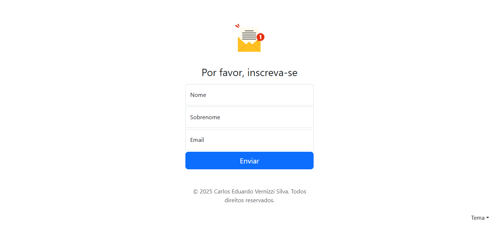

# Newsletter SignUp

Uma aplicação simples de inscrição em newsletter, integrada com a **API do Mailchimp**, permitindo que usuários se inscrevam diretamente em sua lista de emails.

---

## Preview

---

## Funcionalidades

- Formulário de inscrição com campos:
  - Nome
  - Sobrenome
  - Email
- **Integração com Mailchimp** para gerenciar automaticamente as inscrições.
- Validação de dados:
  - Campos obrigatórios (`required`)
  - Nome e sobrenome apenas com letras e espaços
  - Email válido
- Troca de tema:
  - Claro
  - Escuro
  - Automático (baseado no tema do sistema)
- Layout responsivo utilizando **Bootstrap 5**

---

## Tecnologias utilizadas

- HTML5
- CSS3
- JavaScript
- Bootstrap 5
- **Mailchimp API** (para integração do formulário com lista de emails)

---
